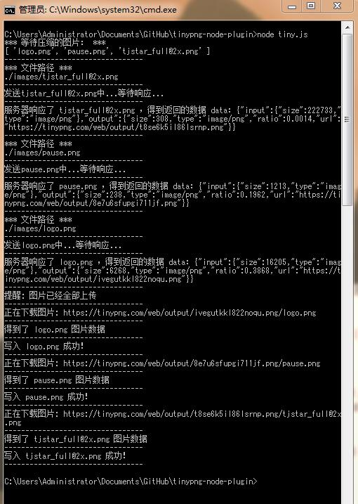

tinypng-node-plugin
===================

纯粹模拟浏览器的行为  
自动上传图片到 https://tinypng.com/ 官网，并自动下载压缩后的图片

gulp插件版本地址：https://github.com/paper/gulp-tinypng-nokey

###ChangeLog

####1.2
1. 提高下载图片成功率。下载图片时，模拟浏览器下载  
1. 注释上传图片时传的cookie  
   
####1.1
1. 如果使用 官网提供的 key-api 方式 (https://tinypng.com/developers)  
   每个月限制是500张(免费用户)，也不稳定（大陆）
   
1. 研究发现，最初版本在没有vpn的情况下，很不稳定。  
   所以改为：一张一张上传，然后一张一张下载，要好一些 :D

###Demo 截图

